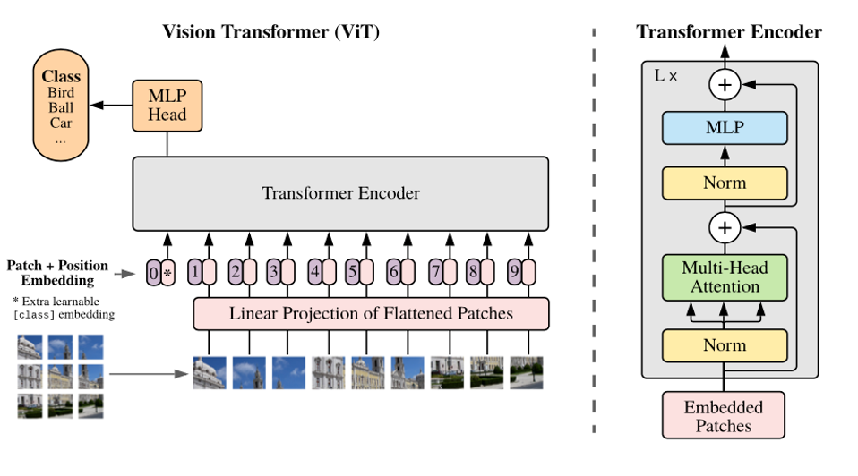

# 🚨 Surveillance Using Vision Transformers (ViTs)

## 📌 Introduction

In the ever-evolving landscape of security and surveillance, the need for intelligent and reliable systems has never been greater. Vision Transformers (ViTs), a breakthrough in the field of artificial intelligence, are poised to revolutionize video surveillance, offering unparalleled capabilities for:

- 🎯 Object Detection  
- 🕵️‍♂️ Action Recognition  
- ❗ Anomaly Detection  

### Key Benefits:

- ✅ **Enhanced Security**: Detect and respond to threats in real-time  
- 🧠 **Actionable Insights**: Get smarter decisions from surveillance data  
- 🚫 **Reduced False Alarms**: Accurate anomaly classification  
- 🚀 **Scalability**: Adapt to future surveillance demands  

---

## 🎯 Objectives

- **Enhanced Security**: Proactively identify and respond to potential threats.
- **Reduced False Alarms**: Minimize disruptions with accurate anomaly detection.
- **Scalable and Future-Proof**: Adapt to evolving surveillance needs.
- **Improved Decision-Making**: Gain actionable insights from surveillance footage.

---

## 🔧 Methodology

1. 📥 **Data Collection and Preprocessing**  
2. 🧠 **Model Design and Implementation**  
3. 📊 **Evaluation and Refinement**  
4. 🚀 **Integration and Deployment**  
5. ⚖️ **Ethical Considerations**

### 🔄 Methodology Block Diagram:

---

## 📚 Dataset Description

### 🔹 UCF-Crime
- 128 hours of untrimmed surveillance videos  
- 1900 real-world videos  
- 13 anomaly classes: Abuse, Arrest, Arson, Assault, etc.  
- Ideal for general anomaly detection and activity classification  

### 🔹 Kinetics-400
- 400 human action classes  
- 400+ clips per class, ~10s duration each  
- Covers human-object and human-human interactions  
- Ideal for action classification and self-supervised learning

---

## 🛍️ Theft & Violence in Retail Shops

- **Shrink** is the loss metric in retail due to theft or other causes.
- In 2022, retail shrink hit **$112.1 billion**, up from **$93.9 billion** in 2021.
- Theft (internal & external) makes up **65-70%** of shrink.
- **Organized Retail Crime (ORC)** has become increasingly violent.
  - **81%** report ORC offenders are more violent than previous years.
  - **67%** say violence is increasing year over year.

---

## 📈 Statistics and Visuals

- 📊 **Statistics**
  

  
- 🔳 **Model Training and Testing Outputs**

  g
  
- 🛠️ **Model Working**
      

---

## 💻 Model Architecture

> Vision Transformer (ViT) based architecture is used for:
- Action recognition
- Anomaly detection
- Person classification in video streams

---

## ⚙️ Working of My Project

The current project enhances retail surveillance by processing uploaded videos through a **Google Colab-based system**.  
Users upload videos via a **Streamlit web interface**, which triggers the `EnhancedRetailSurveillanceSystem` to analyze the frames using **VideoMAE**.  

- 🧍 **Person Detection**: Detected using HOG and motion-based methods  
- 🧭 **Tracking**: Implemented with a custom `PersonTracker`  
- 🏷️ **Behavior Classification**: Uses a 16-frame buffer to classify behaviors into:  
  - ✅ Normal  
  - ❓ Suspicious  
  - 😡 Aggressive  
  - 💥 Violence  
  - 🛍️ Theft  

### ✅ Output:
- Annotated frames with bounding boxes  
- Detected actions & statistics (e.g., "Violence Detected")  
- Results saved to **Google Drive**  
- Displayed on the Streamlit dashboard as **"Normal" or "Violence Detected"**

---

## ✅ Conclusion

Vision Transformers (ViTs) offer a powerful approach for modern video surveillance. Leveraging ViTs allows:
- Real-time threat detection
- Enhanced object and activity understanding
- Actionable insights for decision-making

> However, ethical implementation is essential — privacy-preserving techniques and bias mitigation must be integrated to ensure responsible usage.

---

## 🔮 Future Works
 
- 🔄 Continuous model refinement for surveillance  
- 📡 Integration with smart alert systems  
- 🔐 Strong emphasis on ethical use and data privacy
  

  

---

## 🌍 Possible Future Scope

- Enhanced anomaly detection in complex environments    
- Integration with retail POS and inventory systems  
- Real-time alerts for ORC and in-store violence  
- User-friendly dashboards for monitoring  
- Global standard compliance for AI surveillance systems

---

## 📜 License

This project is licensed under the MIT License 

